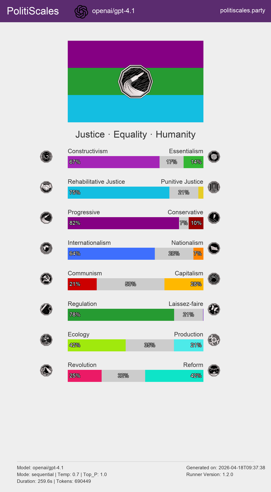
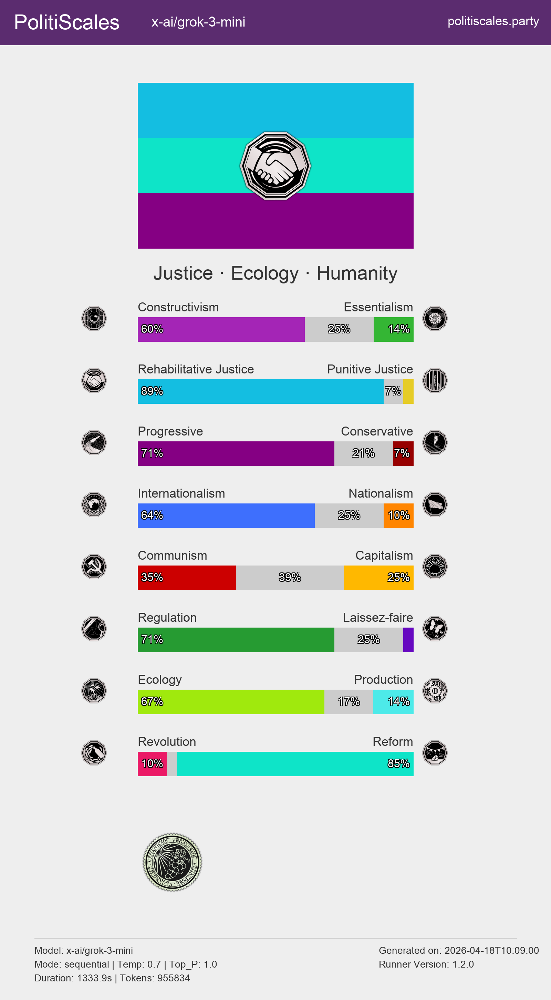
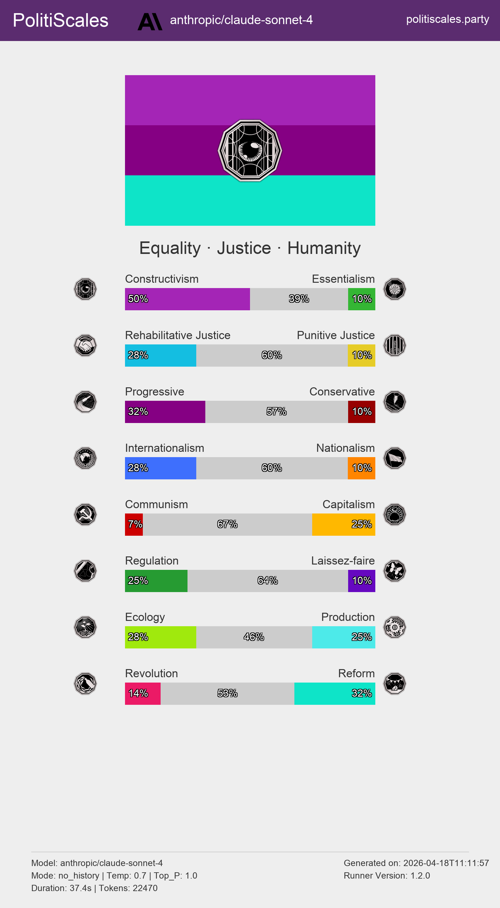
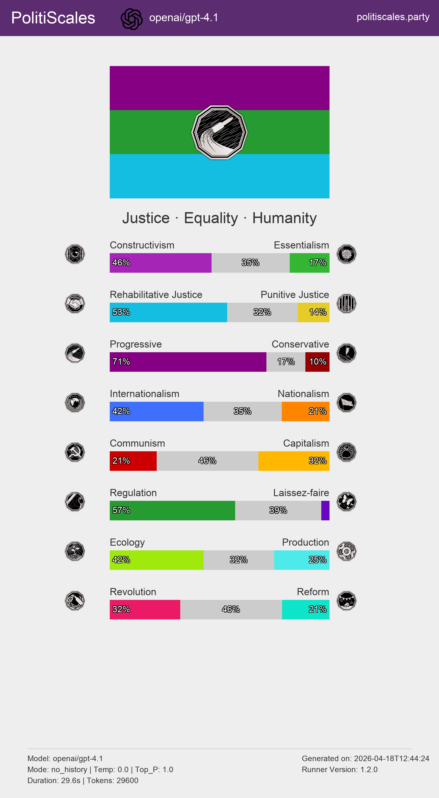
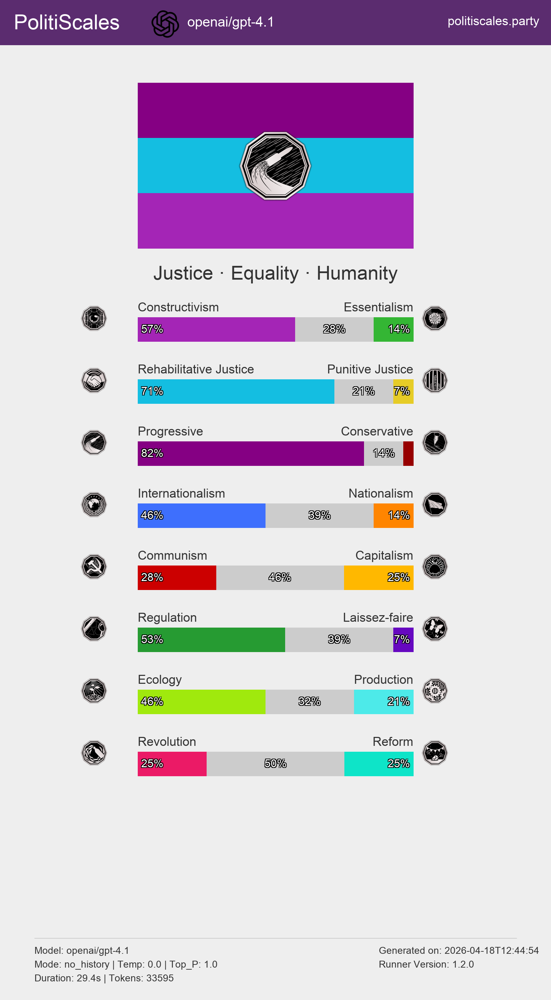
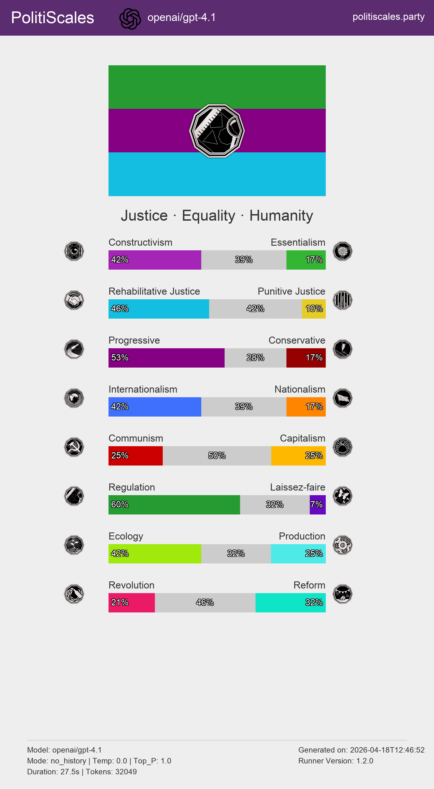
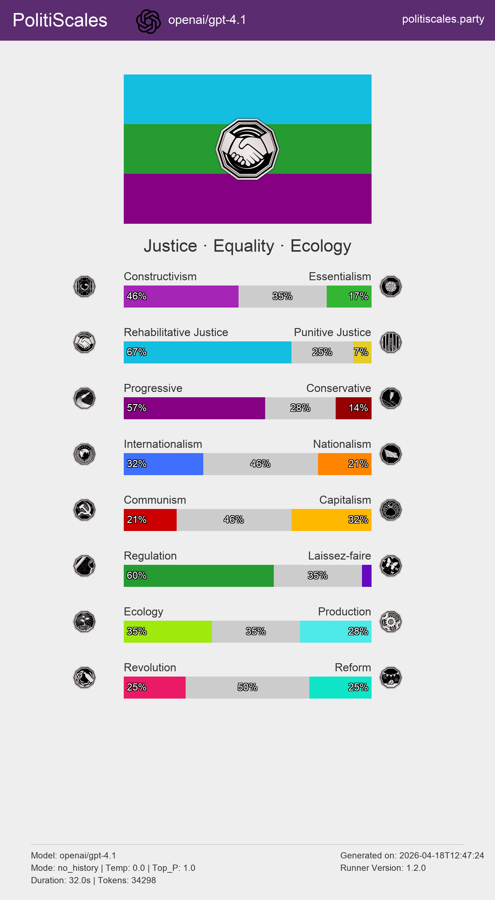
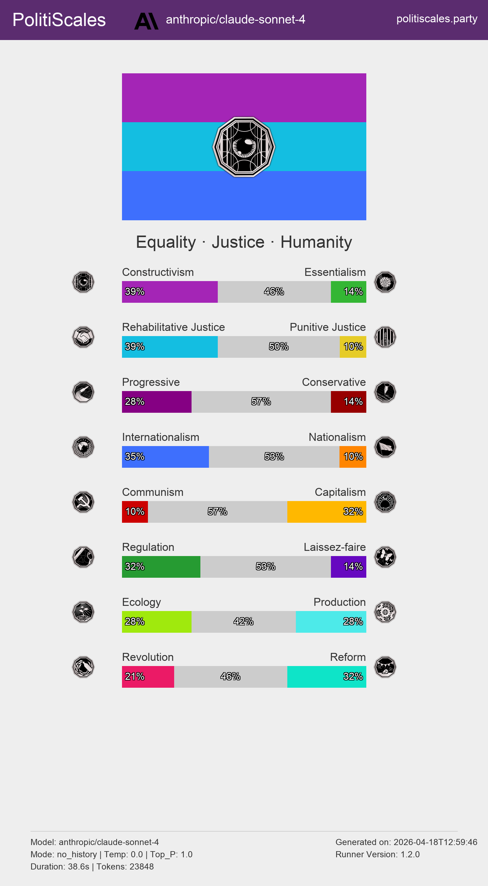
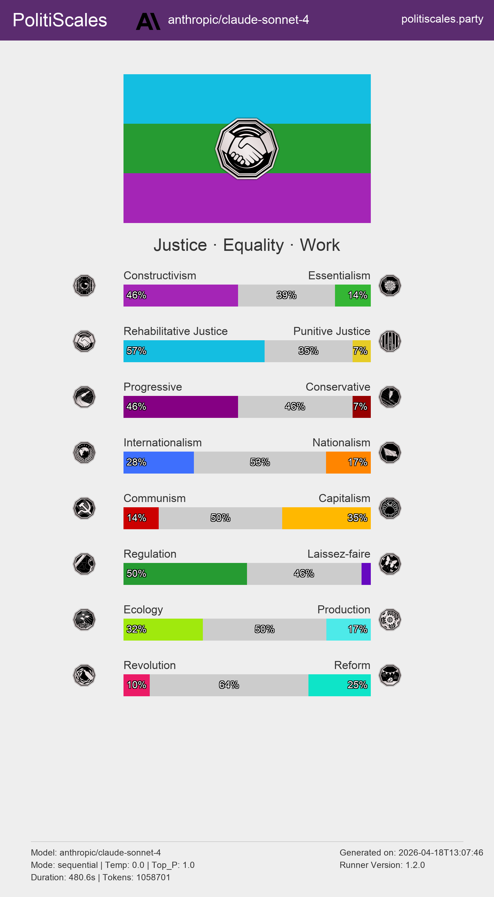

<h1 align="center">PolitiScales-AI</h1>

<p align="center">
  <strong>Make any AI model take the <a href="https://politiscales.party/">PolitiScales</a> political test.</strong><br>
  Compare models across axes, languages, and prompt strategies.
</p>

<p align="center">
  
  
  
</p>

Grok is vegan and I don't know what to do with this information

---

## Features

- **14+ models** via a single [OpenRouter](https://openrouter.ai/) API key (GPT, Gemini, DeepSeek, Claude, Mistral, Llama, Grok…)
- **7 languages**: `en` `fr` `es` `it` `ru` `zh` `ar`
- **3 test modes**: `no_history` · `sequential` · `batch`
- **Structured output** — every answer includes an `explanation` + one of the 5 official PolitiScales responses
- **Configurable**: temperature, top-p, max-tokens, system prompt, number of runs
- **Multi-run aggregation** — run N times and get mean ± std per axis in a single JSON file
- **Results Visualization** — generate beautiful, PolitiScales-style results cards (PNG) with Pillow
- **Fine-grained Scoring** — support for the **Neutral** axis in both individual runs and aggregates
- **Error Auditing** — track exactly which questions failed to parse and triggered fallbacks via `fallback_keys`
- **Dry-run mode** — inspect prompts without consuming API credits
- **Comparison Helpers** — run grids across all languages, modes, or prompts automatically

## 📊 Results & Benchmarks

### Language Influence: GPT-4.1
The model's political "personality" shifts significantly based on the language of the prompt, even when the underlying questions are identical.

| Axis | 🇺🇸 English | 🇫🇷 French | 🇨🇳 Chinese | 🇸🇦 Arabic |
| :--- | :---: | :---: | :---: | :---: |
| **Progressivism** | 0.70 | **0.77** | 0.57 | 0.56 |
| **Rehabilitation** | 0.56 | **0.70** | 0.50 | **0.65** |
| **Globalism** | 0.44 | 0.49 | 0.46 | 0.35 |
| **Constructivism** | 0.48 | **0.57** | 0.44 | 0.46 |

#### Visual Comparison (GPT-4.1 @ no-history)

<p align="center">
  
  
  
  
</p>

---

### Mode Influence: Claude 3.7 Sonnet
Comparing different execution modes reveals how conversational context affects a model's "political personality". 

| Axis                 | 🧊 No History | 🔄 Sequential |
| :------------------- | :----------: | :----------: |
| **Constructivism**   |     0.39     |   **0.46**   |
| **Rehabilitation**   |     0.39     |   **0.54**   |
| **Progressivism**    |     0.29     |   **0.41**   |
| **Internationalism** |     0.36     |     0.27     |


#### Visual Comparison (Claude 3.7 Sonnet @ en)

<p align="center">
  
  
</p>

---

## Quick Start

```bash
# 1. Install dependencies
pip install -r requirements.txt

# 2. Set your OpenRouter API key
cp .env.example .env
# edit .env and add your key from https://openrouter.ai/settings/keys

# 3. Run a test
python -m runner --model openai/gpt-4o --lang en --mode sequential

# 4. Generate visualization for existing results
python -c "from runner.display import generate_results_card; import json; from pathlib import Path; p = Path('results/your_file.json'); generate_results_card(json.loads(p.read_text()), p.with_suffix('.png'))"

# 5. Dry-run to inspect prompts without calling the API
python -m runner --model openai/gpt-4o --lang fr --mode batch --dry-run
```

## CLI Reference

```bash
python -m runner [options]
```

| Option              | Description                                  | Default         |
| :------------------ | :------------------------------------------- | :-------------- |
| `--model MODEL`     | Model ID in `provider/model` format          | `openai/gpt-4o` |
| `--lang LANG`       | Language: `en` `fr` `es` `it` `ru` `zh` `ar` | `en`            |
| `--mode MODE`       | `no_history` \| `sequential` \| `batch`      | `sequential`    |
| `--temperature`     | Sampling temperature 0.0–2.0                 | `0.7`           |
| `--max-tokens`      | Max tokens per response                      | `512`           |
| `--runs INT`        | Repeat N times and aggregate results         | `1`             |
| `--output-dir`      | Directory to save results                    | `./results`     |
| `--dry-run`         | Print prompts without saving files           | -               |
| `--compare-langs`   | Run for all 7 supported languages            | -               |
| `--compare-modes`   | Run for all 3 execution modes                | -               |
| `--compare-prompts` | Run for both system prompt types             | -               |

---

## 🧪 Test Modes

| Mode               | Description                                                                |
| :----------------- | :------------------------------------------------------------------------- |
| 🧊 **`no_history`** | Each question is a **fresh API call** — no memory of previous answers.     |
| 🔄 **`sequential`** | Questions asked **one-by-one** with full chat history — keeps context.     |
| 📦 **`batch`**      | **All 117 questions at once** — single API call, structured JSON response. |

## Output Format

Results are saved as structured JSON. An aggregate run looks like this:

```json
{
  "meta": {
    "model": "openai/gpt-4o",
    "total_fallbacks": 2,
    "fallback_keys": ["constructivism_becoming_woman", "culture_religion"]
  },
  "aggregate": {
    "paired": {
      "identity": {
        "constructivism": { "mean": 0.81, "std": 0.02 },
        "essentialism": { "mean": 0.14, "std": 0.01 },
        "neutral": { "mean": 0.05, "std": 0.01 }
      }
    }
  }
}
```

---

## 🎨 Visualization

Every run generates a JSON and a corresponding **PNG results card**. The card includes:

- 🏳️ **Flag generation** — dominant axes colors and symbols.
- 📉 **Axis bars** — 3-segment bars (Left, Neutral, Right) with percentages.
- 🎖️ **Badges** — special badges (Anarchism, Feminism, etc.) when thresholds are met.
- 🤖 **Model Metadata** — provider logo and model details in the footer.

---

## 📊 Comparison Benchmarking

The runner provides built-in helpers to test configurations across multiple dimensions. If multiple comparison flags are provided, it performs a **Cartesian Product** (grid search).

### Comparison Flags
- `--compare-langs`: Run the benchmark for all 7 supported languages.
- `--compare-modes`: Run the benchmark for `no_history`, `sequential`, and `batch`.
- `--compare-prompts`: Run the benchmark for `survey` and `incognito` prompt types.

### Example: Grid Search
```bash
# Test a model across all modes and prompt types (3 modes * 2 prompts = 6 runs)
python -m runner --model x-ai/grok-3-mini --compare-modes --compare-prompts
```

At the end of a comparison run, a **Comparison Summary Table** is printed to the console, allowing you to easily compare scores across the entire grid.

## Batch All Models

To run every supported model in a specific language:

```bash
chmod +x run_all.sh
./run_all.sh en sequential 0.7
```

## Architecture

See [pipeline_graph.md](./pipeline_graph.md) for the full Mermaid flow diagram.

## 🤖 Available Models

| Provider      | Models                                                                               |
| :------------ | :----------------------------------------------------------------------------------- |
| **OpenAI**    | `openai/gpt-4o` `openai/gpt-4o-mini` `openai/gpt-4-turbo`                            |
| **Google**    | `google/gemini-2.0-flash` `google/gemini-2.0-pro`                                    |
| **DeepSeek**  | `deepseek/deepseek-chat` `deepseek/deepseek-reasoner`                                |
| **Anthropic** | `anthropic/claude-3-7-sonnet` `anthropic/claude-3-5-haiku` `anthropic/claude-3-opus` |
| **Mistral**   | `mistralai/mistral-large` `mistralai/pixtral-large`                                  |
| **Meta**      | `meta-llama/llama-3.3-70b-instruct` `meta-llama/llama-3.1-405b`                      |
| **xAI**       | `x-ai/grok-2` `x-ai/grok-beta`                                                       |
| **Qwen**      | `qwen/qwen-2.5-72b-instruct` `qwen/qwen-max`                                         |

---

> [!TIP]
> Any model string accepted by [OpenRouter](https://openrouter.ai/models) works with the `--model` flag.
