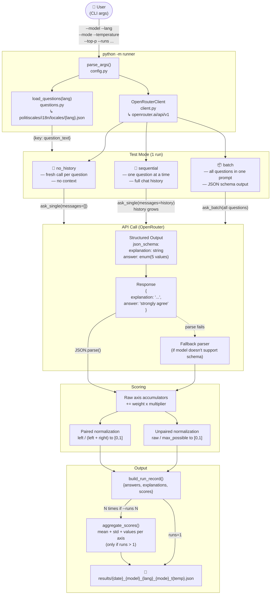

# PolitiScales-AI — Pipeline Graph



## Answer → Score Multiplier

| Answer | yes_mult | no_mult |
|--------|----------|---------|
| strongly agree | 1.0 | 0.0 |
| agree | 0.5 | 0.0 |
| neutral | 0.0 | 0.0 |
| disagree | 0.0 | 0.5 |
| strongly disagree | 0.0 | 1.0 |

## Axis Normalization

| Type | Formula |
|------|---------|
| **Paired** (10 pairs, 20 axes) | `left / (left + right)` → `[0.0 … 1.0]` |
| **Unpaired** (7 badge axes) | `raw_score / max_possible_score` → `[0.0 … 1.0]` |

## File Structure

```
politiscales-AI/
├── politiscales/              ← git submodule (questions + weights source)
│   └── i18n/locales/          ← en, fr, es, it, ru, zh, ar
├── runner/
│   ├── __main__.py            ← entry point: python -m runner
│   ├── config.py              ← RunConfig dataclass + argparse
│   ├── questions.py           ← load from submodule i18n
│   ├── scorer.py              ← scoring engine + aggregation
│   ├── client.py              ← OpenRouter API client (OpenAI-compat)
│   ├── output.py              ← serialize results to JSON
│   └── modes/
│       ├── no_history.py      ← stateless per-question
│       ├── sequential.py      ← one-by-one with chat history
│       └── batch.py           ← all questions in one call
├── results/                   ← JSON output (gitignored)
├── run_all.sh                 ← batch-test all models
├── requirements.txt
├── .env.example
└── pipeline_graph.md          ← this file
```
